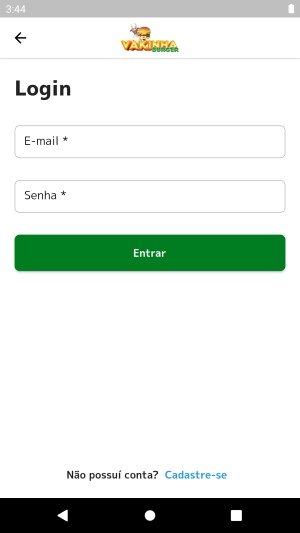

<p align="left">


  
  
  
  

</p>


### Tópicos 

:small_blue_diamond: [Sobre o Projeto](#star-sobre-o-projeto)

:small_blue_diamond: [Objetivo](#dart-objetivo)

:small_blue_diamond: [Imagens](#sunrise_over_mountains-imagens)

:small_blue_diamond: [Pacotes Utilizados](#gear-pacotes-utilizados)

:small_blue_diamond: [Como rodar a aplicação](#arrow_forward-como-rodar-a-aplicação)

## :star: Sobre o Projeto 

Aplicativo desenvolvido durante a Dart Week, evento gratuito organizado pela Academia do Flutter (https://academiadoflutter.com.br/).

Este projeto foi desenvolvido utilizando:

:heavy_check_mark: Provider + Bloc para gerenciamento de estado e injeção de dependência.
:heavy_check_mark: json_rest_server para simualação de um back-end.

## :dart: Objetivo

Vakinha Burger é um aplicativo de delivery, onde foram implementadas as funcionalidades abaixo:

:white_check_mark: **Cadastro de Usuário**
  - Permite a inclusão de um novo usuário

:white_check_mark: **Login** 
  - Utilizando access e refresh token para autenticação
  
:white_check_mark: **Sacola de Compras**
  - Permite a inclusão, atualização e exclusão de produtos da sacola

:white_check_mark: **Pedido**
  - Inclusão do pedido


## :sunrise_over_mountains: Imagens

### :iphone: Mobile


#### :white_check_mark: Tela Inciial


#### :white_check_mark: Cadastro de Usuário


#### :white_check_mark: Login

#### :white_check_mark: Produtos


#### :white_check_mark: Detalhes do Produto


####  :white_check_mark: Carrinho de Compras


####  :white_check_mark: Carrinho de Compras


## :gear: Pacotes Utilizados 

### :station: Server
- :white_check_mark:[Json Rest Server](https://pub.dev/packages/json_rest_server)


### :iphone: Mobile
- :white_check_mark:[flutter_dotenv](https://pub.dev/packages/flutter_dotenv)
- :white_check_mark:[dio](https://pub.dev/packages/dio)
- :white_check_mark:[intl](https://pub.dev/packages/intl)
- :white_check_mark:[loading_animation_widget](https://pub.dev/packages/loading_animation_widget)
- :white_check_mark:[top_snackbar_flutter](https://pub.dev/packages/top_snackbar_flutter)
- :white_check_mark:[bloc](https://pub.dev/packages/bloc)
- :white_check_mark:[flutter_bloc](https://pub.dev/packages/flutter_bloc)
- :white_check_mark:[equatable](https://pub.dev/packages/equatable)
- :white_check_mark:[match](https://pub.dev/packages/match)
- :white_check_mark:[auto_size_text](https://pub.dev/packages/auto_size_text)
- :white_check_mark:[shared_preferences](https://pub.dev/packages/shared_preferences)
- :white_check_mark:[auto_size_text](https://pub.dev/packages/auto_size_text)
- :white_check_mark:[validatorless](https://pub.dev/packages/validatorless)
- :white_check_mark:[flutter_awesome_select](https://pub.dev/packages/flutter_awesome_select)
- :white_check_mark:[build_runner](https://pub.dev/packages/build_runner)
- :white_check_mark:[match_generator](https://pub.dev/packages/match_generator)


## :arrow_forward: Como rodar a aplicação 

#### :warning: Pré-Requisitos

- [Git](https://git-scm.com/)

#### :heavy_check_mark: Clonando o Projeto

No terminal, clone o projeto: 

```
https://github.com/dgo-angelo/vakinha_burger_2023.git
```

### :station: Server

#### :warning: Pré-Requisitos

- :link: [Dart](https://dart.com)


#### :arrow_forward: Executando a aplicação

1) Acessar a pasta ```server``` do projeto
2) Executar o comando abaixo, que disponibilizará a api no endereço http://localhost:8080
```
json_rest_server run
```

3) A API disponibiliza os seguintes endpoints:

##### :unlock: Rotas que não necessitam autenticação:

:heavy_check_mark: **/products**:


:heavy_check_mark: **/login**


:heavy_check_mark: **/register**


##### :lock: Rotas que necessitam autenticação:

:heavy_check_mark: **/payment-types**


:heavy_check_mark: **/order**


### :iphone: Mobile

#### :warning: Pré-Requisitos

- [Dart](https://dart.dev/get-dart)
- [Flutter](https://docs.flutter.dev/get-started/install)

#### :arrow_forward: Executando a aplicação

Acessar o arquivo main.dart, e pressionar F5, ou executar o comando abaixo na raiz do projeto: 

```
 flutter run -d all
```

Antes de executar, verifique se você possuí um dispositivo ou emulador pronto para ser utilizado.

Abra a paleta de comandos e digite : Flutter e a seguir a opção Select a device;

Será aberta uma janela exibindo os dispositivos android disponíveis. Basta selecionar o desejado.
<hr/>